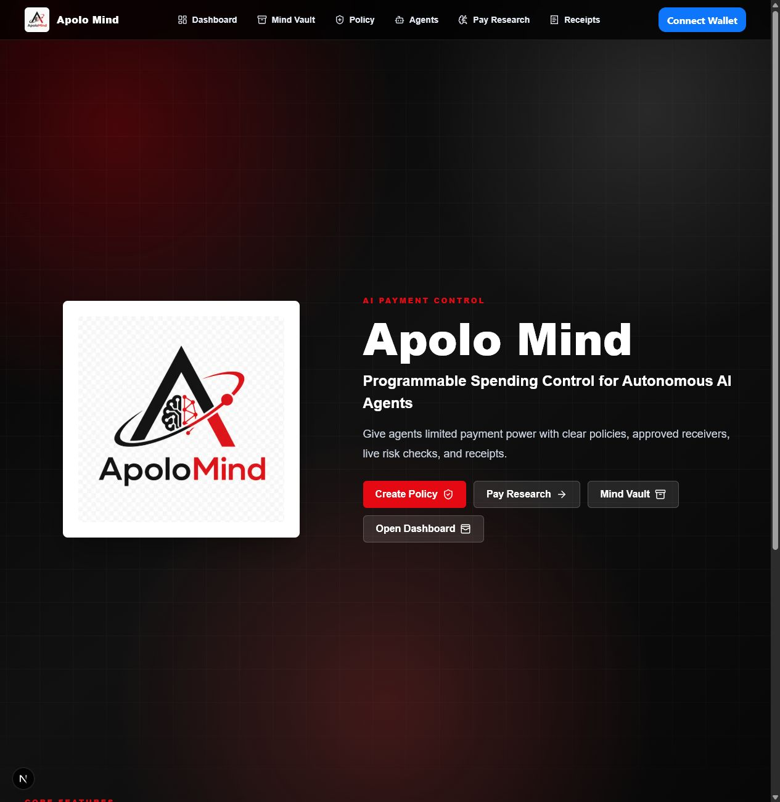
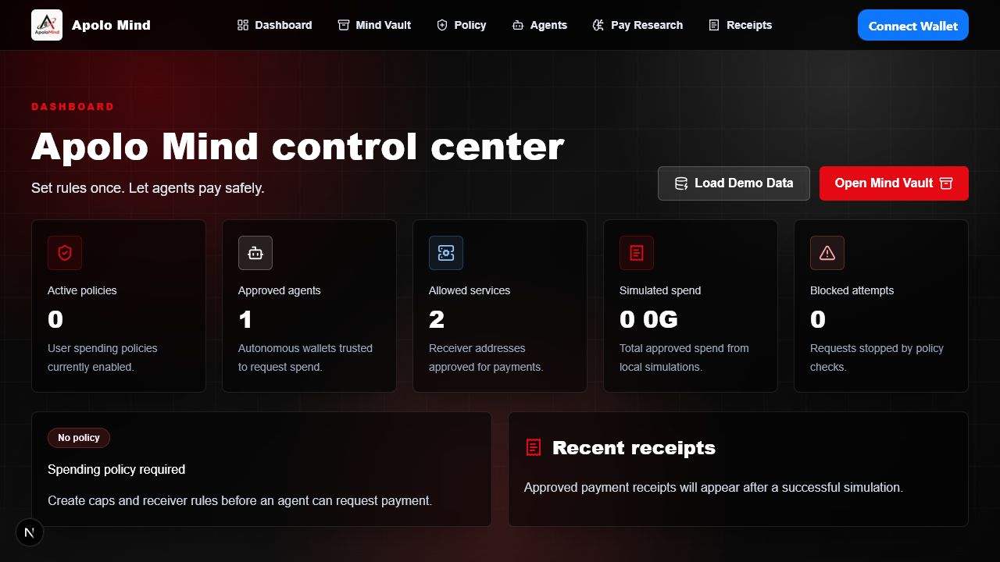
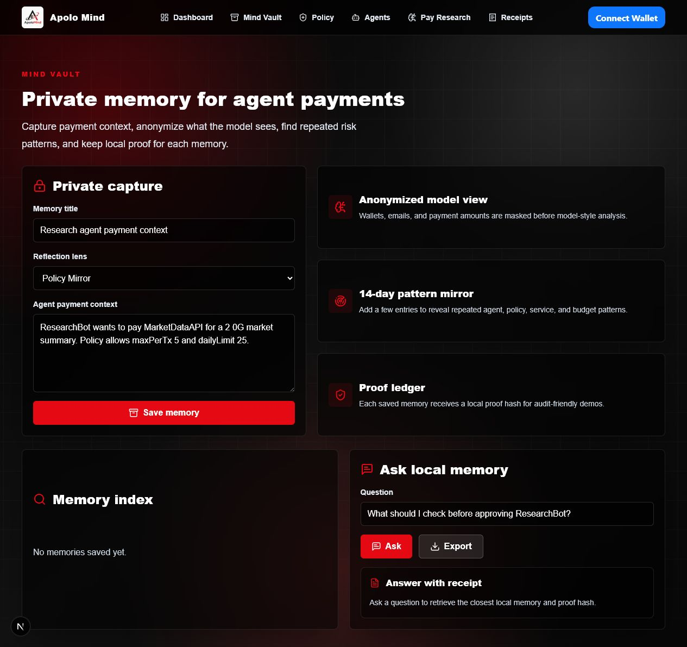
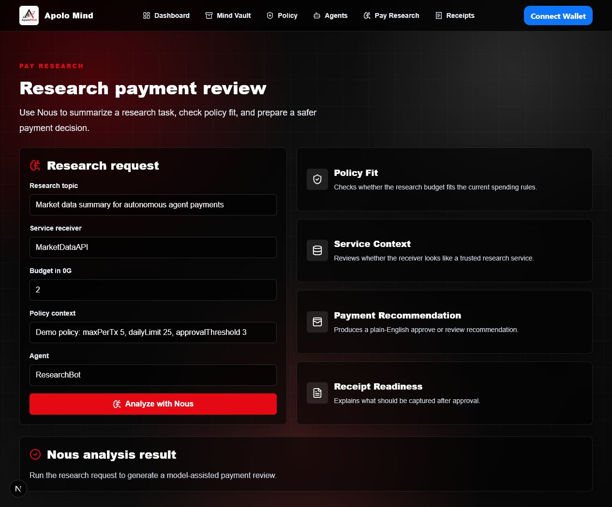
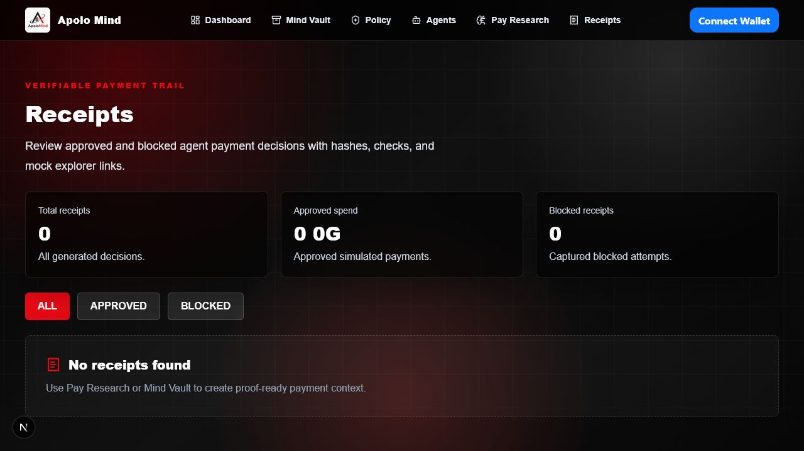
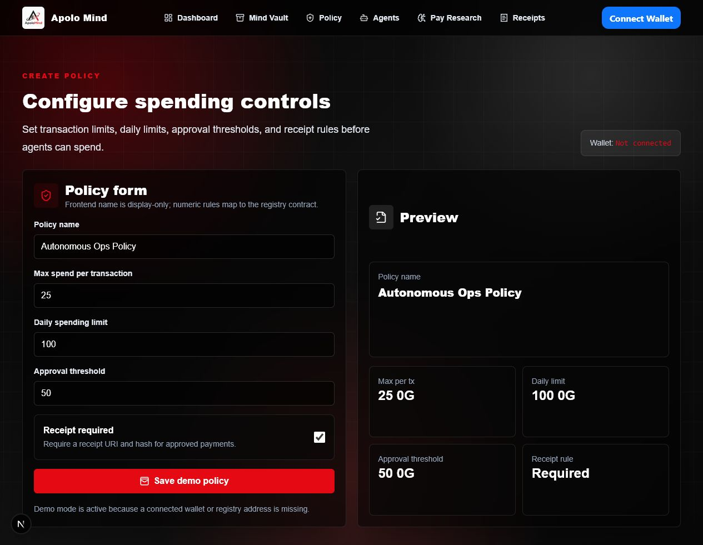
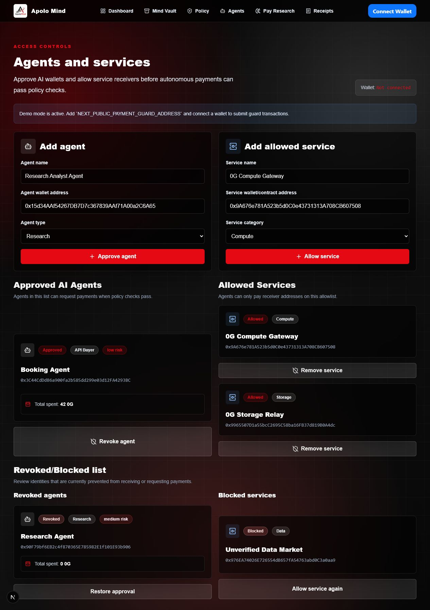
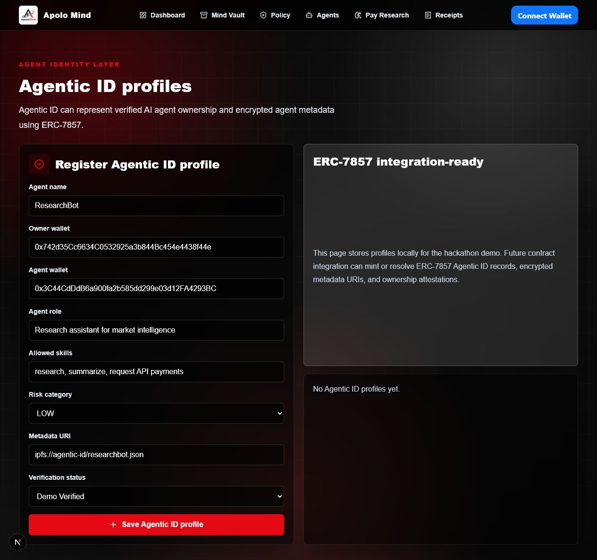
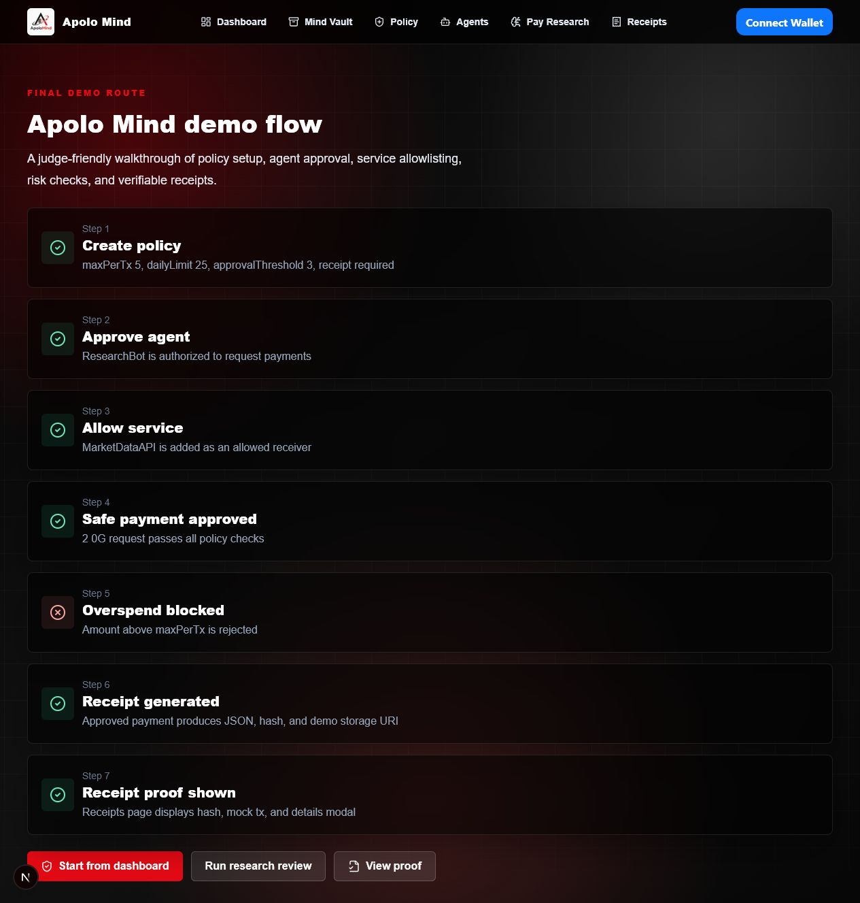

<div align="center">


# Apolo Mind

### Programmable spending control for autonomous AI agents

**Set rules once. Let agents pay safely.**


</div>

Apolo Mind is a policy-based payment safety layer for autonomous AI agents on 0G. It lets users give agents limited payment authority without giving them unlimited wallet control.

Notion project page: https://app.notion.com/p/3a08ee65843481d99bf7ed41c5fe3d63

AI agents are moving from conversation to action. They will buy API credits, pay for research, rent compute, access data, renew tools, and make small operational payments while people are busy. That is useful, but it creates a hard question: if an agent can spend for me, how do I know it will spend safely?

Apolo Mind is built for that question. It turns agent payments from a blind permission into a controlled relationship: **rules first, payment second, proof always.**

## Product Screens

<div align="center">

| Landing | Dashboard | Mind Vault |
| :---: | :---: | :---: |
|  |  |  |

| Pay Research | Receipts |
| :---: | :---: |
|  |  |

| Create Policy | Agents | Agentic ID |
| :---: | :---: | :---: |
|  |  |  |

| Demo Flow |
| :---: |
|  |

</div>

## The Problem

Wallets were designed for humans clicking buttons. Autonomous AI agents need a different trust model.

When an agent can spend, several real risks appear:

- It can overspend when a task loops, fails, or is poorly scoped.
- It can pay a receiver the user never approved.
- It can exceed a daily budget before the user notices.
- It can create payments with no clear reason or audit trail.
- It can make useful automation feel financially unsafe.

This matters in daily life. A student may want an agent to buy data for a research task. A developer may want an agent to pay for inference or storage. A small business may want an assistant to compare SaaS tools and renew only approved services. Without policy controls, users either approve everything manually or give agents too much power.

Apolo Mind creates the missing middle path.

## The Solution

Apolo Mind adds a payment safety layer between the user wallet and autonomous AI agents.

Users can:

- Create spending policies with per-transaction limits, daily caps, approval thresholds, and receipt requirements.
- Approve specific AI agent wallets.
- Allow trusted service receiver addresses.
- Review research-payment requests with a Nous-powered analysis flow.
- Preserve private agent-payment context in Mind Vault.
- Generate proof-ready receipts for approved payment actions.
- Prepare for future 0G Storage, 0G Compute, 0G Pay, and Agentic ID integrations.

The principle is simple: an AI agent should be able to help you act faster, but it should never get unlimited financial power by default.

## Proven Daily Use Cases

Apolo Mind is designed around ordinary agent-payment moments that are likely to become common:

| Use case | Why policy control matters |
| --- | --- |
| Research agent buys market data | The payment should stay below the user policy and go only to an approved provider. |
| Developer agent buys API credits | The agent can work faster without exceeding a daily budget. |
| Business assistant renews SaaS tools | The user keeps receiver allowlists and receipts for audit. |
| Data agent purchases datasets | Each purchase keeps a reason, risk review, and receipt hash. |
| Personal productivity agent handles small expenses | The user gets convenience without handing over full wallet control. |

Small payments at agent speed can become large risk. Apolo Mind makes those actions visible, bounded, and reviewable.

## What Apolo Mind Does

Apolo Mind is one control surface for agentic payments:

- **Policy Registry:** create, update, deactivate, and read spending policies.
- **Payment Guard:** approve agents, allow services, check policy rules, and record receipts.
- **Mind Vault:** save local payment context, anonymize sensitive text, generate local proof hashes, and ask the local memory index.
- **Pay Research:** use a server-side Nous API call to summarize payment intent and recommend review or approval.
- **Receipts:** inspect payment proof, local receipt state, storage URI placeholders, on-chain payment IDs, and transaction hashes when available.
- **Agentic ID UI:** prepare verified agent identity data for future ERC-7857 support.
- **Wallet Support:** RainbowKit and Wagmi integration with MetaMask, OKX Wallet, Rabby, WalletConnect, Coinbase Wallet, injected wallets, and Coin98.

## Control by Architecture

Apolo Mind reduces trust through layered controls:

1. **User policy first:** each agent action is checked against user-defined limits.
2. **Agent approval:** only approved agent wallets should request spend.
3. **Service allowlist:** payments are restricted to trusted receiver addresses.
4. **Daily spend tracking:** repeated small payments cannot silently exceed the daily cap.
5. **Reason and risk analysis:** vague or high-value requests are flagged.
6. **Receipts:** approved activity can produce a verifiable record.
7. **Private context:** Mind Vault keeps sensitive payment reasoning local in demo mode.
8. **0G-ready design:** policy and receipt references can move deeper on-chain and into decentralized storage/compute.

## Why 0G

0G is a strong fit for agentic payment workflows because policy execution, receipt storage, risk checks, and agent identity can live close to decentralized infrastructure.

| 0G component | How Apolo Mind uses or prepares it |
| --- | --- |
| 0G Chain | Deployed smart contracts for policy registry and payment guard references. |
| 0G Pay | Future payment rail for real agent-triggered payments after policy approval. |
| 0G Storage | Future receipt and log storage. Current app clearly marks demo-mode storage. |
| 0G Compute | Future decentralized risk checks. Current risk logic is frontend/demo mode. |
| Agentic ID | Integration-ready identity UI for verified agent ownership and metadata. |

The MVP avoids overclaiming. Smart contracts are deployed on 0G Galileo Testnet. Storage, compute, 0G Pay, and ERC-7857 minting are marked as future or demo-mode unless fully wired.

## Proof, Not Promises

Current verified status:

- `npm run lint` passes.
- `npm run typecheck` passes.
- `npm run build` passes.
- `npm run compile` passes.
- `npm test` passes.
- Nous endpoint has been tested locally with `provider: nous` and `model: nousresearch/hermes-4-70b`.
- Screenshots in this README were captured from the local running app.
- Vercel config is included at `vercel.json`.

Latest 0G Galileo Testnet deployment:

| Contract | Address |
| --- | --- |
| AgentPolicyRegistry | `0x1128E66806605bCEf7836147C60a222CDa47cA53` |
| AgentPaymentGuard | `0x0cf76Ce76684AB75978dE7e27046Faf63dC7898A` |

Explorer: `https://chainscan-galileo.0g.ai`

Deployment metadata is stored in `deployments/0g-galileo.json`.

## Built With

Next.js App Router, TypeScript, Tailwind CSS, Solidity, Hardhat, Wagmi, Viem, RainbowKit, Nous Hermes 4 70B, and 0G Galileo Testnet.

## Project Structure

```text
contracts/
  AgentPolicyRegistry.sol
  AgentPaymentGuard.sol
scripts/
  deploy.ts
frontend/
  app/
  components/
  lib/
deployments/
  0g-galileo.json
README.md
vercel.json
```

## Smart Contracts

- `AgentPolicyRegistry.sol`: create, update, deactivate, and read payment policies.
- `AgentPaymentGuard.sol`: approve and revoke agents, allow and remove services, check spend, track daily spend, and record payment receipts.

## Frontend Pages

- `/`: landing page
- `/dashboard`: metrics and demo seed loading
- `/mind-vault`: private payment memory, anonymized model view, index, mirror, proof ledger, and export
- `/create-policy`: policy creation
- `/agents`: agent and service controls
- `/agentic-id`: Agentic ID profile UI
- `/pay-research`: Nous-powered research payment review
- `/receipts`: receipt proofs, filters, details, and JSON export
- `/demo`: judge-friendly walkthrough

## Demo Flow

1. Open `/dashboard`.
2. Load demo data.
3. Review the demo spending policy.
4. Confirm ResearchBot and MarketDataAPI.
5. Save payment context in `/mind-vault`.
6. Run a research payment review in `/pay-research`.
7. Inspect proof-ready receipt context in `/receipts`.

## Run Locally

```bash
npm install
npm run dev
```

Open `http://localhost:3000`.

## Deploy Frontend on Vercel

This repository is ready for Vercel deployment from the project root. The included `vercel.json` tells Vercel to run the root build script and use the Next.js app inside `frontend`.

Recommended Vercel settings:

- Framework Preset: `Next.js`
- Install Command: `npm install`
- Build Command: `npm run build`
- Output Directory: `frontend/.next`

Add these environment variables in Vercel Project Settings:

```bash
NEXT_PUBLIC_REGISTRY_ADDRESS=
NEXT_PUBLIC_PAYMENT_GUARD_ADDRESS=
NEXT_PUBLIC_WALLETCONNECT_PROJECT_ID=
NEXT_PUBLIC_ENABLE_REAL_0G_STORAGE=false
NOUS_API_KEY=
NOUS_API_BASE_URL=https://inference-api.nousresearch.com/v1
NOUS_MODEL=nousresearch/hermes-4-70b
```

Do not add `PRIVATE_KEY` to the frontend deployment unless you are intentionally running server-side contract deployment from Vercel. Contract deployment should usually stay local or in a protected CI environment.

## Deploy Contracts

```bash
cp .env.example .env
npm run compile
npm run deploy:0g
```

Set `.env` values first. Never commit private keys.

## Environment Variables

```bash
PRIVATE_KEY=
OG_RPC_URL=
OG_CHAIN_ID=
NEXT_PUBLIC_REGISTRY_ADDRESS=
NEXT_PUBLIC_PAYMENT_GUARD_ADDRESS=
NEXT_PUBLIC_WALLETCONNECT_PROJECT_ID=
NEXT_PUBLIC_ENABLE_REAL_0G_STORAGE=false
NOUS_API_KEY=
NOUS_API_BASE_URL=https://inference-api.nousresearch.com/v1
NOUS_MODEL=nousresearch/hermes-4-70b
```

## Current Status

Apolo Mind is a hackathon MVP with real deployed smart contracts, a working frontend, wallet integration, a Nous-backed research review route, and demo-mode receipt and memory flows.

The product direction is serious: safer financial autonomy for AI agents. The emotional core is simple. People should be able to benefit from autonomous agents without feeling that they have surrendered control of their money. Autonomy should feel useful, not dangerous.

## Roadmap

- Replace demo receipt URI flow with real 0G Storage upload.
- Wire live 0G Pay transfer flow after policy approval.
- Move risk analyzer to 0G Compute for decentralized checks.
- Add ERC-7857 Agentic ID minting and encrypted metadata resolution.
- Add stronger test coverage for policy edge cases and daily limit windows.
- Add richer receipt search, export, and team audit workflows.
