<div align="center">


# Apolo Mind

### Programmable spending control for autonomous AI agents

**Set rules once. Let agents pay safely. Prove every settlement.**

[](https://chainscan.0g.ai)
[](https://chainscan.0g.ai/address/0x94944FB6D36a70E14AF8B984C543E73d444D19A5#code)
[](#quality-and-test-evidence)
[](#verified-0g-storage-proof)

[Mainnet contracts](#verified-mainnet-deployment) · [Live payment proof](#funded-mainnet-payment-proof) · [Screenshots](#product-experience) · [Run locally](#run-locally) · [Project page](https://app.notion.com/p/3a08ee65843481d99bf7ed41c5fe3d63)

</div>

---

Apolo Mind is a policy-enforced payment vault for autonomous agents on 0G. A user can fund a policy without giving an agent unrestricted wallet access. Every payment must satisfy on-chain limits, agent permissions, receiver allowlists, expiry, replay protection, daily accounting, approval thresholds, and receipt requirements.

The result is bounded autonomy: agents can make useful payments, while users retain enforceable control and independently verifiable evidence.

> **Wave 3 result:** Apolo Mind is deployed on 0G Aristotle mainnet. Both contracts are source-verified, a funded guarded payment settled successfully, its pre/final receipts were proof-retrieved from 0G Storage, and an unapproved above-threshold payment was rejected.

## Verify the project in 60 seconds

| Claim | Public or reproducible evidence |
| --- | --- |
| Policy registry is deployed and verified | [`0x48d2A5661340ad0B44f36769F512dFC19773e55D`](https://chainscan.0g.ai/address/0x48d2A5661340ad0B44f36769F512dFC19773e55D#code) |
| Payment guard is deployed and verified | [`0x94944FB6D36a70E14AF8B984C543E73d444D19A5`](https://chainscan.0g.ai/address/0x94944FB6D36a70E14AF8B984C543E73d444D19A5#code) |
| A guarded `0.001 0G` payment settled | [Payment execution transaction](https://chainscan.0g.ai/tx/0x76130405d42e024c4431d0b38398f11b3574f789d16eba2f5450ae689c8b4402) |
| The final 0G Storage root was bound on chain | [Receipt-root finalization transaction](https://chainscan.0g.ai/tx/0xdbab5eba0a3ed117bb3b3654363a9e5d3436fcd136e4e6f204a2ffbe1ea62260) |
| Above-threshold execution was blocked without approval | [Intent creation](https://chainscan.0g.ai/tx/0xe61dc558d76b2afcb32f4bc0ce6f28a7fa3805c19d5b63d50324c171b3d854be) · [Safe cancellation](https://chainscan.0g.ai/tx/0xebd86fe47a728390541773b6869b86067ea0f7c7135264e719f09eebd74c4618) |
| Contracts resist adversarial edge cases | `npm test` → 57 passing; [test matrix](docs/wave3/TEST_MATRIX.md) |
| Full evidence is preserved | [Deployment manifest](deployments/0g-aristotle-wave3.json) · [Payment/Storage proof](deployments/0g-aristotle-wave3-payment-proof.json) |

## The problem

Wallets were designed for humans approving individual actions. Autonomous agents operate continuously and can repeat, retry, or misinterpret a task. Giving an agent an unrestricted wallet creates predictable failure modes:

- A loop or malformed task can overspend.
- A compromised agent can substitute a receiver.
- Many small payments can silently exceed a daily budget.
- A stale request can execute after policy limits change.
- A payment can settle without a durable explanation or receipt.
- AI-generated risk advice can be mistaken for authorization.

Manual approval for every small action removes most of the benefit of autonomy. Unlimited approval removes too much safety. Apolo Mind creates the middle path.

## The solution

Each policy gets its own funded native-0G vault, permissions, limits, reservations, and daily accounting. Agents never receive custody of the vault balance. They can only propose fixed payment intents to explicitly allowed receivers.

| Control | Enforcement |
| --- | --- |
| Maximum per transaction | Rechecked by `AgentPaymentGuard` at intent creation and execution |
| Daily budget | Tracks both settled and reserved value by policy and UTC day |
| Agent permission | Policy owner explicitly approves or revokes each agent address |
| Receiver restriction | Payment receiver is fixed in the intent and must be allowlisted |
| Human approval threshold | One exact above-threshold intent requires policy-owner approval |
| Expiry and replay protection | Unique policy nonce, deterministic intent hash, terminal state, and deadline |
| Receipt requirement | Pre-receipt root is required before execution; final root is bound afterward |
| Emergency response | Policy-scoped pause, cancellation, expiry, and withdrawal of unreserved funds |

## Why 0G

Apolo Mind uses 0G where decentralized infrastructure changes the trust model—not as a badge.

| 0G component | Status | Role in Apolo Mind |
| --- | --- | --- |
| **0G Chain** | **Live on Aristotle** | Holds policy state and vault funds, reserves intents, enforces permissions/limits, settles native 0G, and binds receipt roots |
| **0G Storage** | **Mainnet proof verified** | Stores canonical pre-payment and final receipt JSON; roots are locally computed, proof-retrieved, byte-matched, and linked to the payment |
| 0G Compute | Roadmap | Planned replacement for advisory risk analysis; it will never bypass deterministic contract authorization |
| Agentic ID | Integration-ready UI | Planned ownership verification and encrypted agent metadata; no mint is claimed today |
| 0G Pay | Future rail | Not claimed by this version; native-0G escrow is the demonstrated payment path |

Official references: [0G mainnet](https://docs.0g.ai/developer-hub/mainnet/mainnet-overview) · [0G Storage SDK](https://docs.0g.ai/developer-hub/building-on-0g/storage/sdk) · [0G ChainScan](https://chainscan.0g.ai) · [0G StorageScan](https://storagescan.0g.ai)

## Architecture

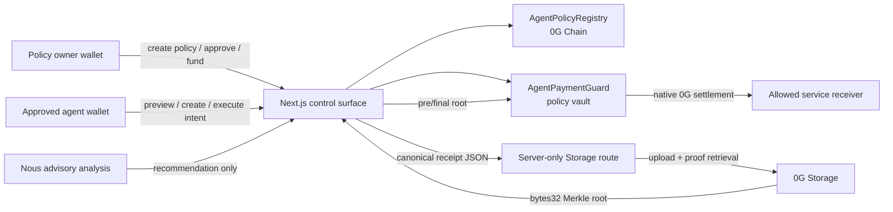
```mermaid
flowchart LR
    Owner[Policy owner wallet]
    Agent[Approved agent wallet]
    UI[Next.js control surface]
    Registry[AgentPolicyRegistry<br/>0G Chain]
    Guard[AgentPaymentGuard<br/>policy vault]
    Receiver[Allowed service receiver]
    StorageAPI[Server-only Storage route]
    Storage[0G Storage]
    Advisory[Nous advisory analysis]

    Owner -->|create policy / approve / fund| UI
    Agent -->|preview / create / execute intent| UI
    UI --> Registry
    UI --> Guard
    Guard -->|native 0G settlement| Receiver
    UI -->|canonical receipt JSON| StorageAPI
    StorageAPI -->|upload + proof retrieval| Storage
    Storage -->|bytes32 Merkle root| UI
    UI -->|pre/final root| Guard
    Advisory -->|recommendation only| UI
```

The smart contracts—not the frontend, AI provider, browser cache, or Storage server—are the source of truth for payment authorization and settlement.

### Payment lifecycle

1. The owner creates a policy with per-transaction, daily, threshold, and receipt rules.
2. The owner approves an agent, allowlists a service receiver, and funds that policy's vault.
3. The agent creates canonical pre-receipt JSON and uploads it to 0G Storage.
4. `previewIntent` returns deterministic eligibility and whether owner approval is required.
5. `createIntent` fixes the chain, guard, policy, nonce, agent, receiver, amount, expiry, reason, decision, and receipt root into one hash.
6. The vault reserves the amount so it cannot be withdrawn or double-promised.
7. Above-threshold intents wait for exact owner approval; low-value eligible intents become ready immediately.
8. `executeIntent` rechecks the current policy, permissions, limits, receipt rule, expiry, and daily allowance before transferring native 0G.
9. The final receipt is uploaded to 0G Storage and its verified root is attached once to the executed intent.

## Verified mainnet deployment

Network: **0G Aristotle mainnet** · Chain ID: **16661** · Explorer: [chainscan.0g.ai](https://chainscan.0g.ai)

| Contract | Address | Deployment transaction |
| --- | --- | --- |
| `AgentPolicyRegistry` | [`0x48d2A5661340ad0B44f36769F512dFC19773e55D`](https://chainscan.0g.ai/address/0x48d2A5661340ad0B44f36769F512dFC19773e55D#code) | [`0xa1d645069720235c8e835fbb5f4348c63029708758b0119ec5a4c2ae70a64921`](https://chainscan.0g.ai/tx/0xa1d645069720235c8e835fbb5f4348c63029708758b0119ec5a4c2ae70a64921) |
| `AgentPaymentGuard` | [`0x94944FB6D36a70E14AF8B984C543E73d444D19A5`](https://chainscan.0g.ai/address/0x94944FB6D36a70E14AF8B984C543E73d444D19A5#code) | [`0x6dcd198bf846c452c0e78b8af1b19b4eeab121c155c726b6ab723d381166ff83`](https://chainscan.0g.ai/tx/0x6dcd198bf846c452c0e78b8af1b19b4eeab121c155c726b6ab723d381166ff83) |

The deployment workflow checked the target chain, balance, pending nonce, predicted addresses, gas ceiling, receipts, full runtime bytecode, constructor immutable, and explorer source verification. It also refuses duplicate deployment when an evidence manifest already exists.

## Funded mainnet payment proof

Policy `1` is a reproducible live proof, not demo state:

| Step | Result | Evidence |
| --- | --- | --- |
| Fund policy vault | `0.02 0G` deposited | [Vault deposit](https://chainscan.0g.ai/tx/0x6675f7bb7ce6ae3f77a9f7bbe9f61838a60cbcf17007aaa3aa2787971ba46c78) |
| Create guarded intent | Fixed `0.001 0G` payment | [Intent transaction](https://chainscan.0g.ai/tx/0x2085b202b761da920d78dbd8dca85721ee5af5959b734fa6cb4cefea1eea3f55) |
| Settle payment | Receiver increased by exactly `0.001 0G` | [Execution transaction](https://chainscan.0g.ai/tx/0x76130405d42e024c4431d0b38398f11b3574f789d16eba2f5450ae689c8b4402) |
| Bind final receipt | Final Storage root attached once | [Finalization transaction](https://chainscan.0g.ai/tx/0xdbab5eba0a3ed117bb3b3654363a9e5d3436fcd136e4e6f204a2ffbe1ea62260) |
| Negative threshold case | `0.006 0G` could not execute without approval | [Created](https://chainscan.0g.ai/tx/0xe61dc558d76b2afcb32f4bc0ce6f28a7fa3805c19d5b63d50324c171b3d854be) · [Cancelled](https://chainscan.0g.ai/tx/0xebd86fe47a728390541773b6869b86067ea0f7c7135264e719f09eebd74c4618) |

Final policy balance: `0.019 0G` available and `0.0 0G` reserved.

### Verified 0G Storage proof

| Receipt | Merkle root | Storage transaction |
| --- | --- | --- |
| Pre-payment receipt | `0x01ab3a98cef0f996585fdc17ad0e3c2748c3d0dec44ba1351cc131ae8eaee0d6` | [`0x37496060610e2b525dd435c4a5a02a49efec7761e9498561cb115c523eaa551f`](https://chainscan.0g.ai/tx/0x37496060610e2b525dd435c4a5a02a49efec7761e9498561cb115c523eaa551f) |
| Final receipt | `0x63448259a19b4c82925118c90de292beefd485a60a57d4f7394899d2469d7674` | [`0x9d13d36880017196b0e773bbfd1cb4fd64fac06b0cbb201ae71459f14d947318`](https://chainscan.0g.ai/tx/0x9d13d36880017196b0e773bbfd1cb4fd64fac06b0cbb201ae71459f14d947318) |

For both receipts, Apolo Mind:

- Canonically serialized the JSON.
- Computed the Merkle root locally.
- Uploaded through the official TypeScript SDK and mainnet indexer.
- Confirmed that the returned root matched the local root.
- Downloaded the object with proof verification enabled.
- Compared the retrieved bytes with the original content exactly.
- Bound the final root to the executed payment on 0G Chain.

Machine-readable proof: [deployments/0g-aristotle-wave3-payment-proof.json](deployments/0g-aristotle-wave3-payment-proof.json)

## What changed in Wave 3

- Replaced the earlier payment path with policy-scoped native-0G escrow.
- Deployed and source-verified both corrected contracts on Aristotle mainnet.
- Added policy-specific deposits, available/reserved balances, and safe withdrawals.
- Added deterministic intent preview, unique nonces, expiry, replay protection, and terminal states.
- Added exact owner approval for above-threshold intents.
- Rechecked current policy limits, permissions, and receipt requirements at execution time.
- Fixed emergency pause isolation so one policy owner cannot affect another policy.
- Added pre-payment and final receipt roots backed by real 0G Storage uploads and proof retrieval.
- Removed fabricated receipt URIs, mock transaction hashes, and mutating demo success states.
- Added mainnet preflight, gas-budget cap, deployment evidence manifests, bytecode checks, and source verification.
- Expanded adversarial coverage to 57 passing contract tests.
- Completed a funded mainnet payment and above-threshold negative case.

Detailed status: [WAVE3_PROGRESS.md](WAVE3_PROGRESS.md)

## Product experience

<div align="center">

| Landing | Dashboard | Mind Vault |
| :---: | :---: | :---: |
| 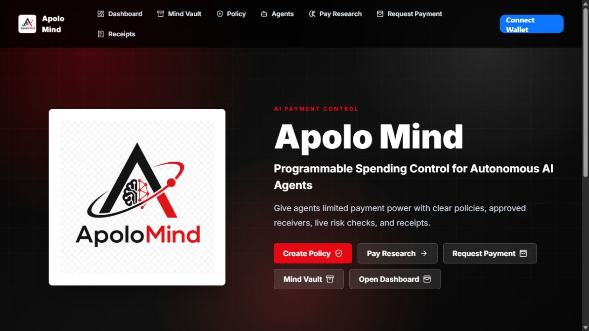 | 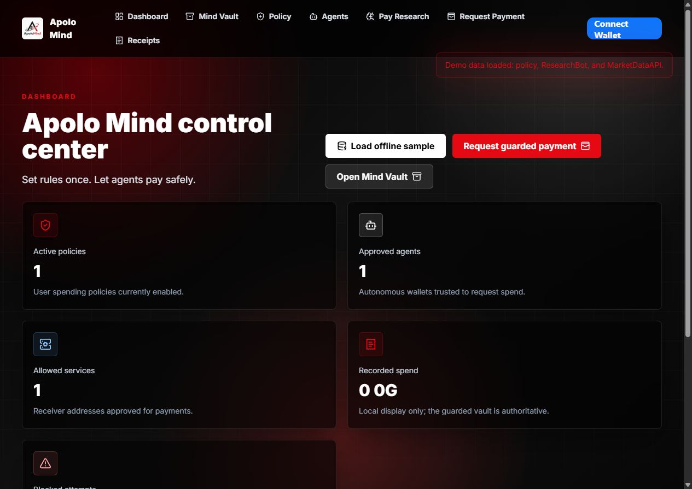 | 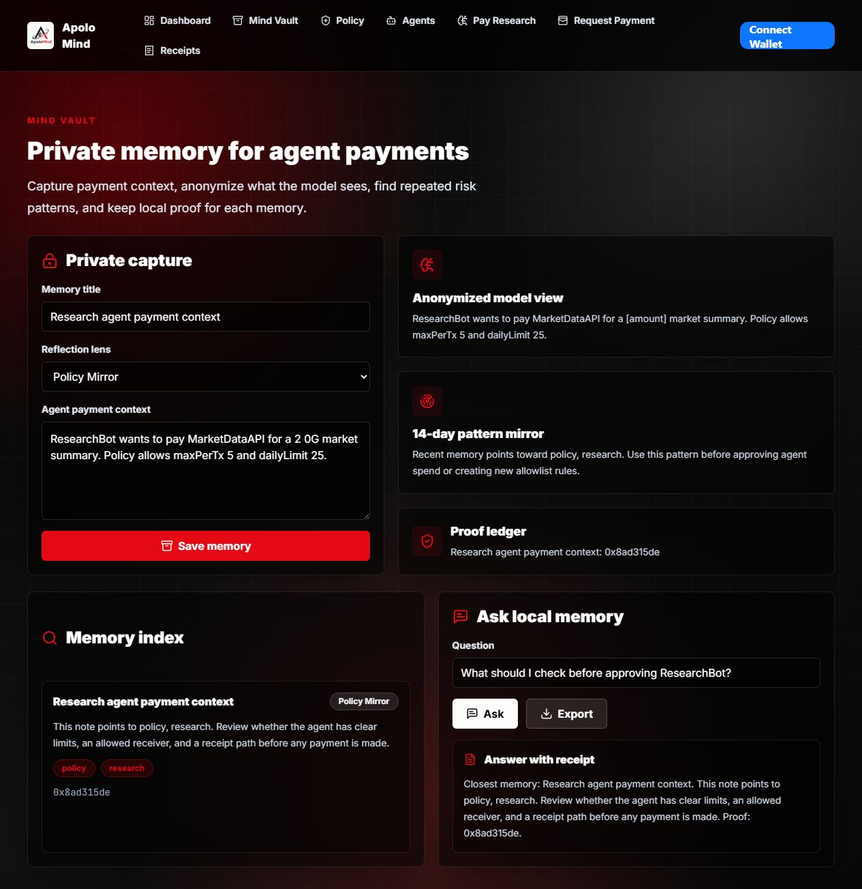 |

| Pay Research | Verification Flow | Receipts |
| :---: | :---: | :---: |
| 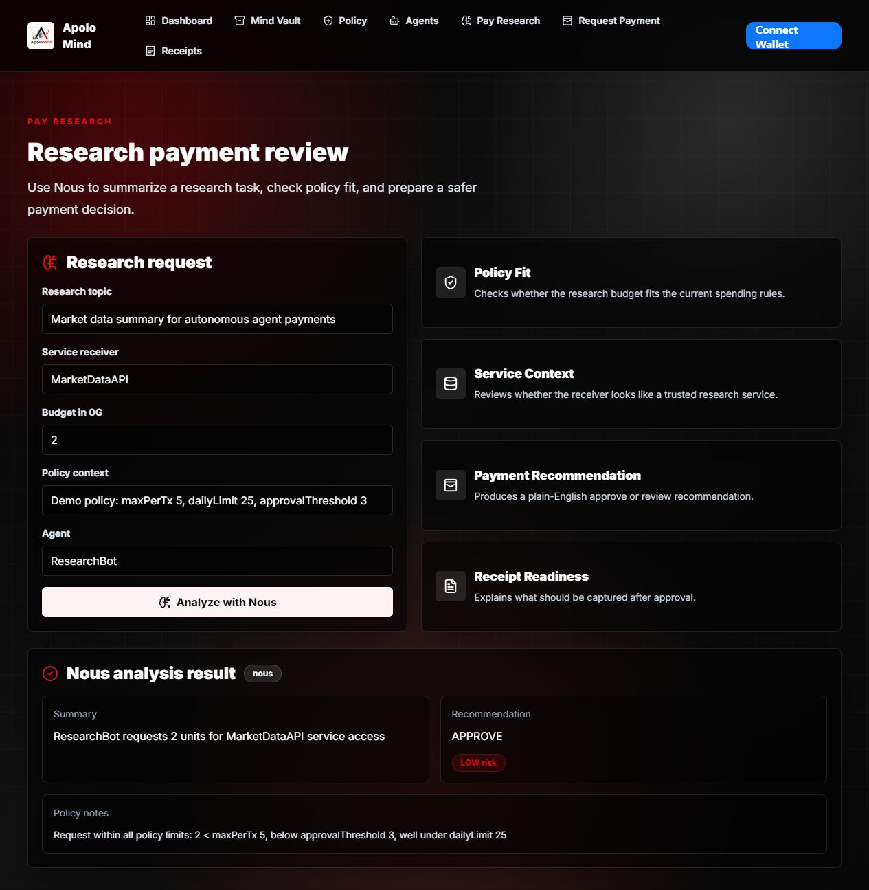 | 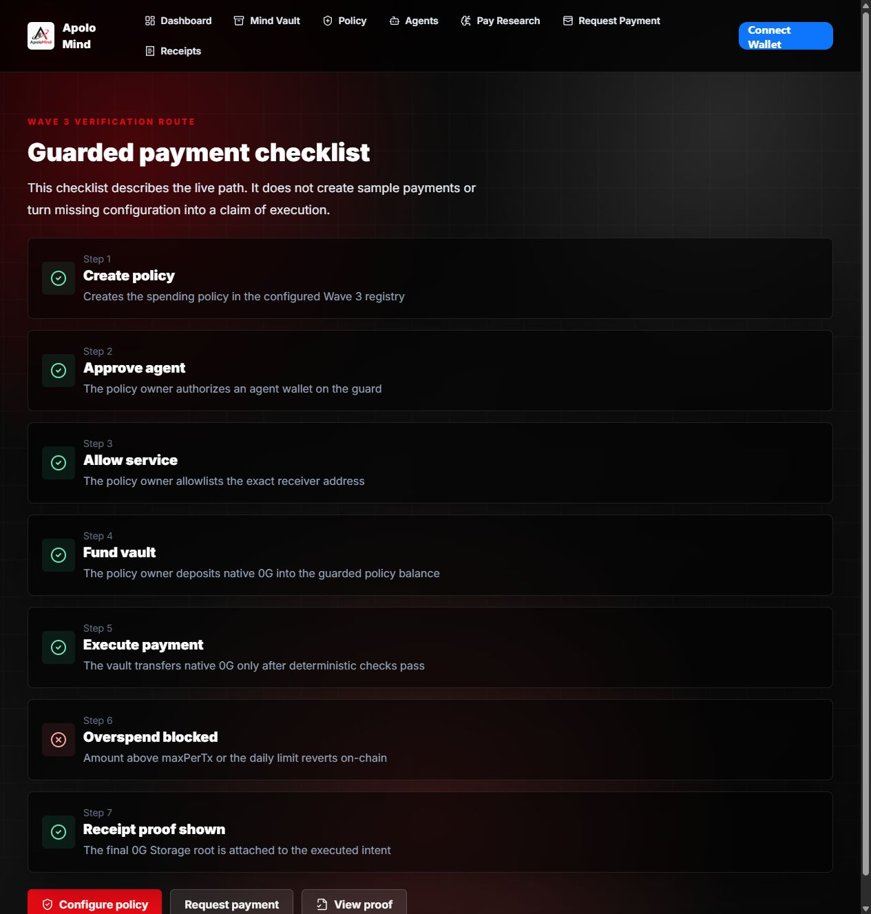 | 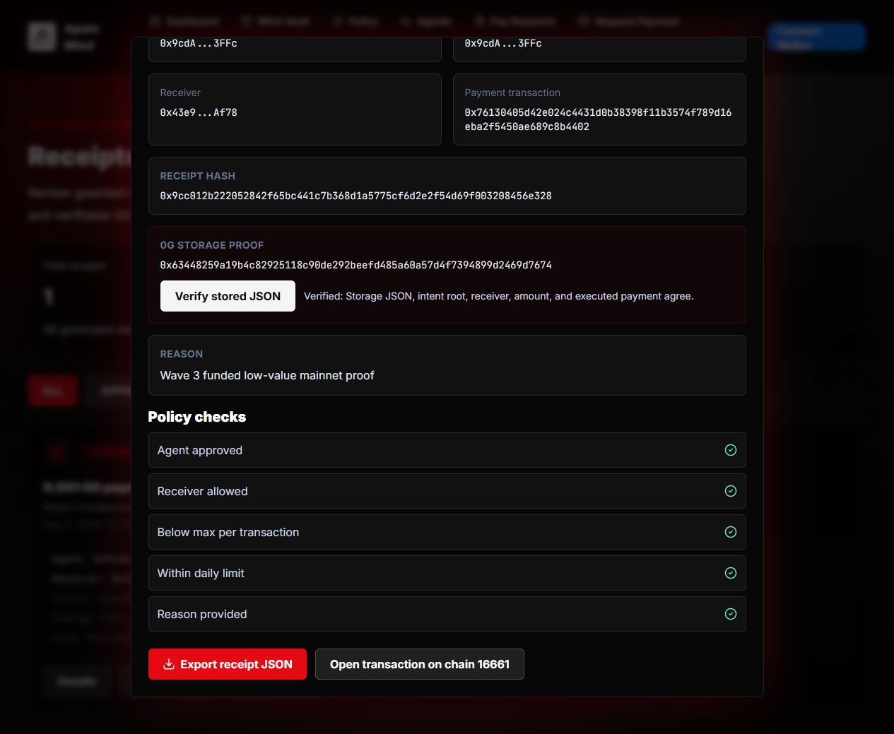 |

| Create Policy | Agents and Services | Agentic ID |
| :---: | :---: | :---: |
| 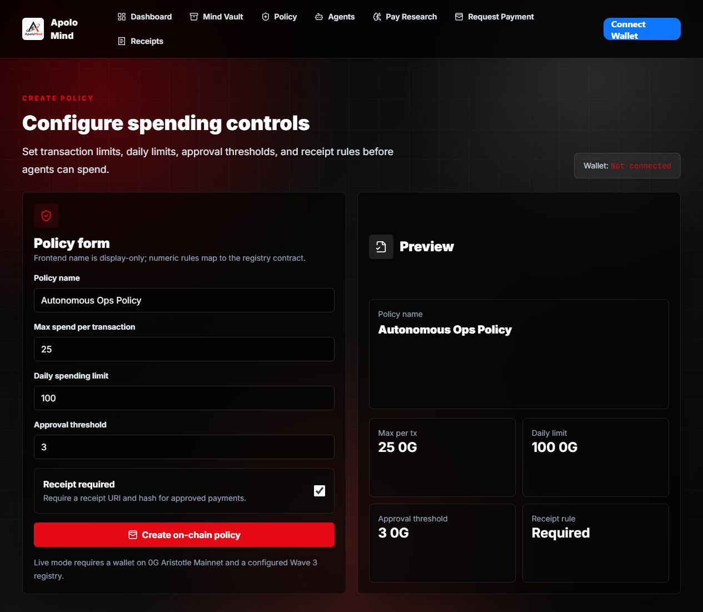 | 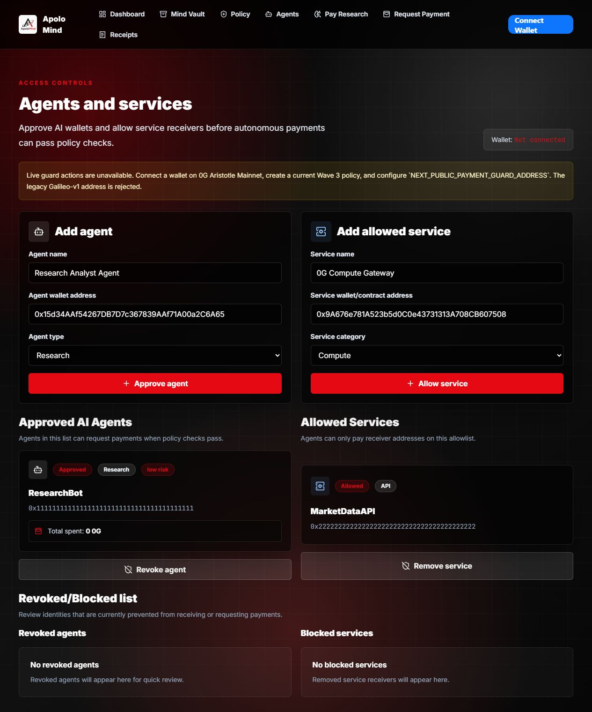 | 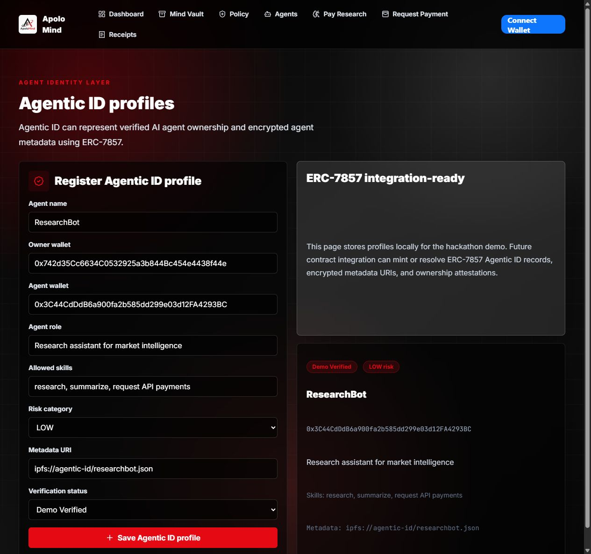 |

| Guarded native-0G payment flow |
| :---: |
| 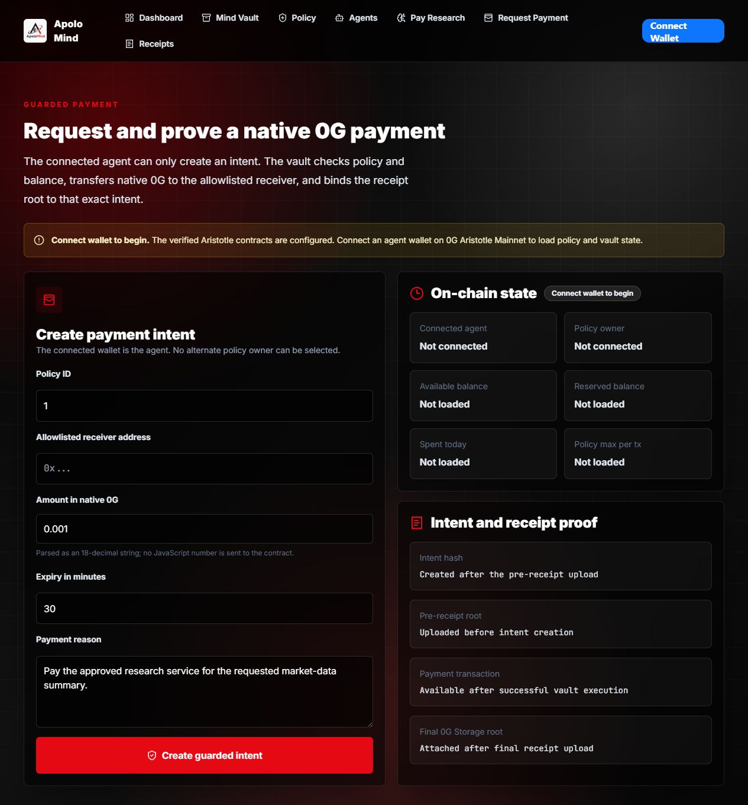 |

</div>

### Feature tour

| Route | Purpose |
| --- | --- |
| `/` | Product story, trust model, and entry points |
| `/dashboard` | Control center, status summaries, and offline sample loading |
| `/create-policy` | Create on-chain spending rules |
| `/agents` | Approve/revoke agent wallets and allow/remove service receivers |
| `/request-payment` | Preview, create, approve, execute, and finalize guarded payments |
| `/receipts` | Inspect transaction links, Storage roots, proof retrieval, and JSON export |
| `/pay-research` | Advisory payment-risk analysis; never an authorization source |
| `/mind-vault` | Local private context, anonymization, proof ledger, and export |
| `/agentic-id` | Integration-ready identity profile UI; minting is future work |
| `/demo` | Non-mutating live verification checklist; it never fabricates payment success |

## Security model

The guiding rule is **rules first, payment second, proof always**.

| Threat | Mitigation |
| --- | --- |
| Unauthorized agent | Per-policy agent approval checked at creation and execution |
| Receiver substitution | Fixed receiver in intent hash plus per-policy allowlist |
| Overspending | Maximum per transaction, daily spent, daily reserved, and available-balance checks |
| Replay | Chain/domain-separated hash, policy nonce, unique intent record, and terminal state |
| Stale policy bypass | Current max, threshold, receipt rule, activity, permissions, and daily limit rechecked at execution |
| Reservation theft | Reserved balance cannot be withdrawn; cancellation/expiry releases it exactly once |
| Reentrancy or reverting receiver | Checks-effects-interactions, OpenZeppelin `ReentrancyGuard`, and full rollback on transfer failure |
| Global emergency-control abuse | Pause state is scoped to one policy and one owner |
| Fake receipt | Real Storage root, proof-enabled retrieval, exact content comparison, and one-time final root binding |
| AI manipulation | AI output is advisory only; deterministic Solidity rules authorize settlement |
| Wrong network or legacy ABI | Explicit chain IDs, live-only bindings, receipt chain checks, and rejection of recorded Galileo-v1 addresses |
| Direct untagged transfer | Contract `receive()` rejects native transfers that are not associated with a policy deposit |

Security documentation: [architecture](docs/wave3/ARCHITECTURE.md) · [threat model](docs/wave3/THREAT_MODEL.md) · [ADR](docs/wave3/ADR-001-guarded-native-0g-escrow.md) · [test matrix](docs/wave3/TEST_MATRIX.md)

## Quality and test evidence

```text
57 passing, 0 failing
99.30% statements
83.54% branches
100% functions
99.45% lines
```

The suite covers policy validation, ownership, permissions, policy isolation, deposits, withdrawals, reservations, per-transaction and daily limits, threshold approvals, cancellation, expiry, replay, stale-policy changes, pause isolation, receiver failures, reentrancy, receipt finalization, day rollover, and event integrity.

Run the complete verification set:

```bash
npm run lint
npm run typecheck
npm run compile
npm test
npm run coverage
npm run build
```

The latest production build generates 16 routes successfully.

## Three-minute demo script

1. **Problem — 20 seconds:** explain why agents need bounded authority instead of unrestricted wallet custody.
2. **Policy — 30 seconds:** show `/create-policy`, transaction limits, daily cap, approval threshold, and receipt requirement.
3. **Permissions — 20 seconds:** show `/agents` and the agent/service allowlists.
4. **Guarded payment — 50 seconds:** show `/request-payment`, deterministic preview, Storage pre-receipt, intent state, approval boundary, and settlement.
5. **Proof — 35 seconds:** open `/receipts`, retrieve the JSON, compare the root, and show the final-root transaction.
6. **Mainnet evidence — 15 seconds:** open the two verified contract links and the funded execution transaction.
7. **Why it matters — 10 seconds:** bounded financial autonomy, deep Chain + Storage integration, and evidence that can be checked independently.

## How to use it

### 1. Create a policy

Connect the policy owner's wallet on 0G Aristotle, open `/create-policy`, and define the maximum payment, daily limit, human-approval threshold, and receipt requirement. The successful transaction returns a policy ID.

### 2. Approve the participants

Open `/agents`. The policy owner approves the exact agent wallet and allowlists the exact receiver address. Permissions are policy-scoped: approval under one policy grants no rights under another.

### 3. Deposit native 0G into the guarded vault

Funds go to **AgentPaymentGuard**, not to AgentPolicyRegistry and not directly to the receiver. From the policy owner's wallet, call the payable function `deposit(policyId)` and attach the native 0G amount as `value`.

```ts
import { ethers } from "ethers";

const guard = new ethers.Contract(
  "0x94944FB6D36a70E14AF8B984C543E73d444D19A5",
  ["function deposit(uint256 policyId) payable"],
  ownerSigner
);

await (await guard.deposit(1n, { value: ethers.parseEther("0.02") })).wait();
```

Do not send 0G to the contract with a plain transfer. Its `receive()` function intentionally rejects untagged funds. The verified example deposit is [visible on ChainScan](https://chainscan.0g.ai/tx/0x6675f7bb7ce6ae3f77a9f7bbe9f61838a60cbcf17007aaa3aa2787971ba46c78).

### 4. Request and settle a payment

Open `/request-payment` with the approved agent wallet. The app uploads the pre-receipt, creates a fixed intent, requests owner approval only when the threshold requires it, executes the guarded transfer, uploads the final receipt, and binds the final Storage root on-chain.

### 5. Verify the result

Open `/receipts` and choose **Load verified mainnet proof** to inspect the funded Aristotle transaction without creating another payment. The detailed receipt links to ChainScan and can proof-download the JSON from 0G Storage.

## Run locally

Requirements: Node.js 22, npm, and a browser wallet that supports custom EVM networks.

```bash
git clone <your-repository-url>
cd ApoloMind
npm install
cp .env.example .env
npm run dev
```

Open [http://localhost:3000](http://localhost:3000). The root scripts preload the root `.env` before starting the nested Next.js project, so the same configuration is used by development, build, and production.

For a production check:

```bash
npm run build
npm start
```

### Environment configuration

| Variable | Scope | Purpose |
| --- | --- | --- |
| `NEXT_PUBLIC_OG_CHAIN_ID` | Browser | `16661` for Aristotle mainnet |
| `NEXT_PUBLIC_REGISTRY_ADDRESS` | Browser | Verified AgentPolicyRegistry address |
| `NEXT_PUBLIC_PAYMENT_GUARD_ADDRESS` | Browser | Verified AgentPaymentGuard address |
| `NEXT_PUBLIC_WALLETCONNECT_PROJECT_ID` | Browser | Optional Reown project ID; injected wallets can still be used locally |
| `OG_RPC_URL` | Server | 0G Chain RPC used by Storage upload signing |
| `OG_STORAGE_INDEXER_RPC` | Server | 0G Storage indexer endpoint |
| `OG_STORAGE_PRIVATE_KEY` | Server secret | Funded Storage upload signer; never expose as `NEXT_PUBLIC_*` |
| `NOUS_API_KEY` | Server secret | Nous Portal inference credential |
| `NOUS_MODEL` | Server | Current model ID used for advisory research analysis |
| `PRIVATE_KEY` | Deployment secret | Contract deployer; not needed to browse the app |

Never commit `.env`, private keys, or deployment secret manifests. `.env.example` contains only public defaults and empty secret fields.

## Developer commands

| Command | Purpose |
| --- | --- |
| `npm run dev` | Start the local Next.js application |
| `npm run build` | Type-check and create the production web bundle |
| `npm start` | Serve the production bundle |
| `npm run compile` | Compile Solidity with Hardhat |
| `npm test` | Run the 57-test contract suite |
| `npm run coverage` | Generate Solidity coverage |
| `npm run preflight:aristotle` | Validate mainnet signer, chain, bytecode assumptions, and deployment budget |
| `npm run deploy:aristotle` | Deploy the two contracts to Aristotle |
| `npm run verify:aristotle` | Compare deployed bytecode/configuration and verify sources |
| `node scripts/storage-smoke.cjs` | Upload, proof-download, and byte-compare a Storage payload |
| `node scripts/mainnet-payment-smoke.cjs` | Run the funded positive and above-threshold negative proof flow; this spends real 0G |

## Technology stack

- Solidity 0.8.27, OpenZeppelin, Hardhat, ethers, and TypeChain.
- Next.js 15, React 19, TypeScript, Tailwind CSS, wagmi, viem, and RainbowKit.
- 0G Aristotle EVM for policy state, guarded balances, approvals, settlement, and receipt-root anchoring.
- 0G Storage TypeScript SDK for upload, Merkle-root retrieval, and proof-enabled download.
- Nous Portal API for advisory research-payment analysis; the Solidity contracts remain the authorization boundary.

## Why this project matters

Wallets give an agent broad custody; API keys give it broad service access. Neither primitive answers the more useful question: **what may this agent pay, to whom, how often, under whose approval, and with what evidence?** Apolo Mind turns those requirements into enforceable, policy-specific state.

Key advantages:

- **Bounded autonomy:** agents can act quickly without receiving unrestricted control of the owner's balance.
- **Deterministic enforcement:** model output cannot override caps, allowlists, ownership, reservations, or approval requirements.
- **Evidence before and after settlement:** the intent commits to a pre-receipt root and the executed payment receives a one-time final root.
- **Independent verification:** judges and integrators can inspect source-verified contracts, transactions, event logs, manifests, and retrieved Storage bytes.
- **Reusable payment primitive:** the guard can sit beneath research agents, compute buyers, storage agents, SaaS automations, and data-market clients.
- **Failure-aware design:** expired, cancelled, replayed, stale-policy, over-limit, unauthorized, reverting-receiver, and reentrancy cases are explicitly tested.

## Example use cases

| Scenario | Policy pattern |
| --- | --- |
| Research agent buying datasets | Small per-request cap, research vendors allowlisted, receipt mandatory |
| Compute agent purchasing inference | Daily compute budget, approved gateways, owner approval above a threshold |
| Storage automation | Restricted Storage relays, predictable limits, root-backed upload receipt |
| Travel or booking agent | Specific merchant receivers, short intent expiry, higher-value manual approval |
| DAO operations bot | Treasury-funded isolated policy, limited agents, auditable payment evidence |
| Enterprise SaaS automation | Vendor allowlist, recurring daily budget, immediate permission revocation |

## Honest boundaries

- The contracts and funded proof are live on Aristotle; the public frontend has not yet been hosted. Run it locally with the commands above.
- The current `Pay Research` route uses the Nous API for advisory analysis. Native 0G Compute execution is roadmap work.
- Agentic ID is an integration-ready local profile experience; ERC-7857 minting/resolution is not claimed as complete.
- 0G Storage uploads are real, but `/api/storage/upload` must receive authentication, rate limits, origin controls, and signer-budget monitoring before public hosting.
- A valid Reown project ID is needed for a warning-free WalletConnect experience. Injected browser wallets remain the simplest local demo path.
- The repository proves one funded low-value mainnet payment. Production deployment still requires an independent audit, multisig operations, key rotation policy, monitoring, and incident response.

## Roadmap

1. Add authenticated relaying and per-user quotas around the Storage signer.
2. Integrate native 0G Compute for policy-risk and service-quality analysis.
3. Add an in-app guarded-vault deposit/withdraw interface with transaction previews.
4. Mint and resolve Agentic ID records instead of local-only profile storage.
5. Add multisig ownership, role separation, indexed event history, and operational alerts.
6. Commission an independent smart-contract review and publish the report.
7. Deploy the frontend, record a concise demo video, and add public demo/repository URLs to the submission.

## Repository map

```text
contracts/                    Solidity policy registry and payment guard
frontend/app/                 Next.js pages and API routes
frontend/lib/                 Contract ABIs, network config, policy and receipt logic
scripts/                      Deployment, verification, signer rotation, and smoke tests
test/                         Positive, negative, adversarial, and invariant-oriented tests
deployments/                  Sanitized machine-readable mainnet evidence
docs/wave3/                   Architecture, threat model, ADR, deployment guide, test matrix
frontend/public/readme/       Browser-captured working-product screenshots
```

## Submission checklist

- [x] Corrected contracts deployed on 0G Aristotle mainnet.
- [x] Contract sources verified on ChainScan.
- [x] Funded low-value guarded payment executed.
- [x] Above-threshold execution rejected without approval.
- [x] Pre/final receipts uploaded and proof-retrieved from 0G Storage.
- [x] Mainnet evidence committed as sanitized JSON.
- [x] 57 contract tests, coverage, lint, typecheck, and production build passing.
- [x] Fresh browser screenshots captured from the production build.
- [ ] Public Git repository URL added to the submission.
- [ ] Hosted frontend URL added to the submission.
- [ ] Short demo video recorded and linked.

## Evidence and disclosure

All contract addresses, transaction hashes, Storage roots, and coverage figures in this README are backed by repository artifacts. No private key is included. No screenshot is presented as proof of settlement when a ChainScan transaction or Storage root is available instead.

For implementation details, begin with [the architecture](docs/wave3/ARCHITECTURE.md), [the mainnet deployment record](docs/wave3/MAINNET_DEPLOYMENT.md), and [the machine-readable payment proof](deployments/0g-aristotle-wave3-payment-proof.json).
