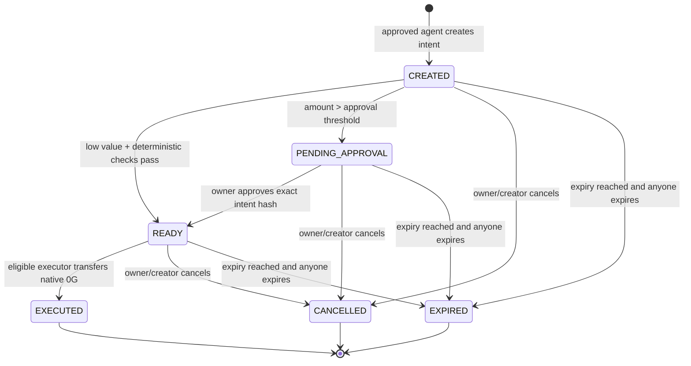

# Wave 3 MVP Architecture

Status: architecture frozen for implementation planning. This document does not describe the current deployed contracts; it describes the smallest secure Wave 3 MVP to implement next.

## Decision summary

Apolo Mind will demonstrate native 0G payments from a funded, policy-scoped escrow vault on 0G Chain. The vault is the only execution path for the demonstrated funds. An unrelated owner EOA balance is not protected by Apolo Mind and must never be described as protected.

The MVP goes deep on 0G Chain, real 0G Storage, and real 0G Compute. Compute is advisory: it may recommend escalation or rejection, but it cannot authorize a payment or override deterministic contract checks. Agentic ID and 0G Pay are future work unless an official, currently supported integration is verified and separately documented.

## Actors and responsibilities

| Actor | Responsibility | Trust assumption |
| --- | --- | --- |
| Policy owner | Creates policy, funds vault, configures agent/service permissions, approves high-value intents, withdraws available funds, deactivates policy | Controls the owner key and understands that only vault funds are guarded |
| Agent wallet | Creates and executes intents within an approved policy | May be compromised; it receives only narrowly scoped vault authority |
| Service receiver | Receives native 0G when an eligible intent executes | Must not be trusted with authorization; receiver address must be allowlisted |
| Connected browser | Presents requests, asks the wallet to sign transactions, calls Compute/Storage, and displays proof | Untrusted client; cannot be the source of truth and must not hold server secrets |
| 0G Compute | Performs risk analysis or classification over a canonical request | Untrusted advisory service; output is treated as data, not authorization |
| 0G Storage | Stores receipt JSON and optional decision evidence | Content-addressed evidence store; root returned by Storage is recorded on chain |
| 0G Chain | Enforces policy, escrow balance, permissions, intent lifecycle, transfer, and recorded roots | Source of truth for all authorization and settlement state |

## Trust boundaries and secrets

1. **Owner boundary:** the owner wallet is the authority for policy configuration, deposits, high-value approvals, deactivation, and withdrawals. The private key never enters the browser application or server.
2. **Agent boundary:** the agent private key is held by the agent runtime/wallet. The contract grants no arbitrary call capability; it can only create/execute the defined native transfer intent.
3. **Browser boundary:** the browser can be modified by extensions, XSS, a compromised dependency, or a malicious RPC response. It may prepare transactions but cannot make an invalid transaction valid.
4. **API/provider boundary:** 0G Compute and any server-side gateway can see the request data sent to it and can return false, stale, or malicious advice. No Compute credential or provider secret is exposed to the browser.
5. **Storage boundary:** receipt content is hosted outside the chain. The browser retrieves the object and recomputes its content hash/root; a root alone is not accepted as proof until content and fields validate.
6. **Chain boundary:** RPC endpoints can censor, delay, or lie about pending state, but finalized chain data and independently queried events are authoritative.

Secrets in scope are only wallet private keys/signers, any server-side 0G Compute credential, and optional Storage uploader credentials. They are never stored in Git, localStorage, receipt JSON, URL parameters, or client bundles. The MVP does not create a separate encryption secret for receipt JSON; therefore receipts must not be called confidential until an encryption/key-recovery design is implemented.

## Source of truth

| Data | Authoritative source |
| --- | --- |
| Policy configuration and active/deactivated state | Vault contract policy storage and events |
| Agent and service permissions | Vault contract mappings keyed by `policyId` |
| Escrow balance and reserved balance | Vault contract accounting and deposit/withdraw events |
| Daily spend | Vault contract mapping keyed by `policyId` and UTC-like chain day (`block.timestamp / 1 days`) |
| Intent nonce, hash, state, expiry, amount, receiver | Vault contract intent storage and events |
| Settlement/payment | Native transfer in the vault execution transaction plus `IntentExecuted` event |
| Pre-execution decision evidence | `decisionRoot` bytes32 stored on the intent, with the corresponding 0G Storage object verified by the app when available |
| Receipt proof | `receiptRoot` bytes32 stored by the vault after settlement, plus the 0G Storage object whose canonical JSON hashes to that root |
| Display/cache state | Browser memory or wallet/chain-scoped local cache only; never authoritative |

## Monetary units

All contract amounts are unsigned integer base units with 18 decimals: `1 0G = 1_000_000_000_000_000_000` base units. The UI accepts decimal strings and converts them with a bigint-safe `parseUnits(value, 18)` equivalent. It never uses JavaScript `number` for an amount, performs no floating-point rounding, and displays chain values through a bigint-safe `formatUnits` equivalent.

The vault stores `balance`, `reserved`, `maxPerTx`, `dailyLimit`, `approvalThreshold`, and `amount` in base units. The contract does not know or trust a UI currency label.

## Policy scope and accounting

Every permission and spend counter is keyed by `policyId`:

- `approvedAgents[policyId][agent]`
- `allowedServices[policyId][service]`
- `dailySpent[policyId][day]`
- `vaultBalance[policyId]` and `reservedBalance[policyId]`

An agent approved under one policy is not approved under another. A service allowed under one policy is not allowed under another. A policy update cannot retroactively alter an already executed payment; an active policy and current limits are checked when an intent is created and again when it is executed.

## Intent lifecycle

Each intent has an owner-generated or contract-generated nonce, a unique `intentHash`, an expiry timestamp, and one-time consumption. The hash covers the immutable policy and payment facts: vault address, chain ID, policy ID, nonce, agent, receiver, amount, expiry, reason hash, and decision root. The vault rejects duplicate hashes and any non-`READY` execution.



`CREATED` and `PENDING_APPROVAL` reserve the requested amount so the owner cannot withdraw it or over-commit it through another intent. `READY` means the exact intent has passed deterministic checks and, where needed, has exact owner approval. `EXECUTED` is set before the external receiver call; a failed receiver transfer reverts the entire transaction, including state changes and daily accounting.

## Payment flows

### Low-value flow

1. The owner deposits native 0G into the vault for a policy.
2. The agent submits receiver, amount, expiry, reason hash, and optional Compute decision root.
3. The vault verifies policy active state, agent permission, receiver permission, nonzero addresses, amount units, per-transaction limit, daily limit including the reserved amount, available balance, and expiry.
4. If the amount is at or below the threshold, the intent becomes `READY`; otherwise it becomes `PENDING_APPROVAL`.
5. The agent or owner executes a `READY` intent. The vault updates accounting, transfers exactly the native amount to the allowlisted receiver, and emits the payment event.
6. The receipt worker canonicalizes settlement data, uploads receipt JSON to 0G Storage, obtains its root, and calls `finalizeReceiptRoot`. The root is cryptographically linked to the intent hash and executed payment fields.

### Above-threshold flow

Steps 1–3 are identical. The intent enters `PENDING_APPROVAL`; the owner must approve the exact `intentHash` before it can become `READY`. Approval is not a blanket agent approval and cannot be reused for a different amount, receiver, policy, nonce, or expiry. The contract checks the current policy and intent facts again at execution.

AI risk output can move the product UI toward escalation, but the contract still requires the owner approval for the configured threshold and always enforces hard limits.

## Owner funds and emergency controls

- `deposit(policyId)` is payable and can be called only for an active policy by its owner. Deposits increase that policy's vault balance.
- `withdraw(policyId, amount, recipient)` is owner-only, checks zero addresses and available (unreserved) balance, updates accounting before transfer, and uses a reentrancy guard.
- A policy owner can deactivate a policy. Deactivation prevents new intents and execution of pending/ready intents; it does not erase history. The owner can withdraw unreserved funds.
- An owner-only, **per-policy** emergency pause stops that policy's deposits, intent creation, approvals, execution, and receipt finalization. Read operations, cancellation, expiry, and withdrawal of available funds remain available. There is no global pause authority: creating or owning another policy cannot pause or unpause this policy.
- No emergency method may redirect another policy's funds or bypass owner authorization.

## Decision and receipt roots

`decisionRoot` is an optional `bytes32` commitment to the canonical pre-execution request/risk evidence stored on 0G Storage. It is evidence, not an authorization input: deterministic contract checks remain decisive.

`receiptRoot` is an optional `bytes32` written only after execution. Canonical receipt JSON must include chain ID, vault address, policy ID, intent hash, nonce, agent, receiver, amount in base units, execution transaction hash, event data, and any Compute decision root. The app computes the canonical content commitment, uploads the JSON to real 0G Storage, and finalizes the returned root. No arbitrary URI or unbounded receipt string is stored on chain.

## Proof page verification

The final proof page reads the intent and payment event from 0G Chain using the configured chain ID and vault address. It independently verifies:

1. the intent exists, has the expected immutable fields, and is `EXECUTED`;
2. the execution event identifies the same intent hash, policy, agent, receiver, amount, and payment transaction;
3. the receipt root stored on chain is `bytes32` and matches the canonical receipt JSON retrieved from 0G Storage;
4. the JSON's chain/payment fields match the chain event and transaction receipt; and
5. the receiver transfer amount and destination match the approved intent.

If Storage retrieval, canonicalization, root comparison, or chain comparison fails, the page shows “proof incomplete/invalid,” never “verified.” Local cache and UI success flags are not proof.

## 0G component scope

- **0G Chain:** authoritative policy and escrow execution layer.
- **0G Storage:** real receipt and optional decision-evidence storage, bound by a recorded root.
- **0G Compute:** real risk/inference call, advisory only; provider, model, request hash, response hash, and timestamp may be included in evidence.
- **Agentic ID:** future work; no demo-selected verification state may be called identity verification.
- **0G Pay:** future work; the MVP uses native 0G escrow and makes no 0G Pay claim.

## Minimal contract interface

Names below are an implementable target interface, not Solidity code. A single `GuardedNativeEscrow` can own this surface; a separate registry is unnecessary for the MVP unless implementation constraints require it.

```solidity
enum IntentState { CREATED, PENDING_APPROVAL, READY, EXECUTED, CANCELLED, EXPIRED }

struct Policy {
    address owner;
    uint256 maxPerTx;          // 18-decimal base units
    uint256 dailyLimit;        // 18-decimal base units
    uint256 approvalThreshold; // must be <= maxPerTx
    bool receiptRequired;
    bool active;
}

struct Intent {
    bytes32 intentHash;
    uint256 policyId;
    uint256 nonce;
    address agent;
    address receiver;
    uint256 amount;
    uint256 expiry;
    uint256 executedAt;
    bytes32 reasonHash;
    bytes32 decisionRoot;
    IntentState state;
    bool ownerApproved;
    bytes32 receiptRoot;
}

function createPolicy(uint256 maxPerTx, uint256 dailyLimit, uint256 approvalThreshold, bool receiptRequired) external returns (uint256 policyId);
function updatePolicy(uint256 policyId, uint256 maxPerTx, uint256 dailyLimit, uint256 approvalThreshold, bool receiptRequired) external;
function deactivatePolicy(uint256 policyId) external;
function deposit(uint256 policyId) external payable;
function withdraw(uint256 policyId, uint256 amount, address payable recipient) external;
function approveAgent(uint256 policyId, address agent) external;
function revokeAgent(uint256 policyId, address agent) external;
function allowService(uint256 policyId, address service) external;
function removeService(uint256 policyId, address service) external;
function previewIntent(uint256 policyId, address agent, address receiver, uint256 amount, uint256 expiry) external view returns (bool allowed, bool needsApproval, bytes32 reason);
function createIntent(uint256 policyId, address receiver, uint256 amount, uint256 expiry, bytes32 reasonHash, bytes32 decisionRoot, bytes32 preReceiptRoot) external returns (bytes32 intentHash);
function approveIntent(bytes32 intentHash) external;
function executeIntent(bytes32 intentHash) external;
function cancelIntent(bytes32 intentHash) external;
function expireIntent(bytes32 intentHash) external;
function finalizeReceiptRoot(bytes32 intentHash, bytes32 receiptRoot) external;
function pause(uint256 policyId) external;
function unpause(uint256 policyId) external;
function policyPaused(uint256 policyId) external view returns (bool);
function getPolicy(uint256 policyId) external view returns (Policy memory);
function isAgentApproved(uint256 policyId, address agent) external view returns (bool);
function isServiceAllowed(uint256 policyId, address service) external view returns (bool);
function getBalance(uint256 policyId) external view returns (uint256 available, uint256 reserved);
function dailySpent(uint256 policyId, uint256 day) external view returns (uint256);
function getIntent(bytes32 intentHash) external view returns (Intent memory);
function getPayment(bytes32 intentHash) external view returns (address receiver, uint256 amount, uint256 executedAt, bytes32 preReceiptRoot, bytes32 finalReceiptRoot);
```

The MVP deliberately has no arbitrary target, calldata, delegatecall, token transfer, or user-supplied external function selector. Its only external interaction is a checked native 0G transfer to the exact allowlisted receiver. The implementation must use checks-effects-interactions and a reentrancy guard; a failed receiver transfer must revert all prior state changes.

## Pre-mainnet correction — 2026-09-01

The implementation uses the existing registry plus an immutable registry-linked vault. Execution rechecks current max-per-transaction, daily, threshold, receipt-required, active and permission rules. A lowered threshold can make a stored `READY` intent require approval: execution reverts with `OwnerApprovalRequired` until the owner calls `approveIntent` for that exact hash. This is an eligibility change, not a rewrite of the historical creation event. A newly required pre-receipt cannot be retrofitted into an immutable intent; cancel it and create a replacement with the root. Neither change invalidates already executed payments.

`PolicyPauseChanged(uint256 indexed policyId, address indexed owner, bool paused)` replaces the misleading global pause event. OpenZeppelin ReentrancyGuard remains; its global Pausable primitive was removed because pause authority must be policy-scoped. See `test/predeployment-security.ts` and `MAINNET_DEPLOYMENT.md` for measured results and deployment status.
